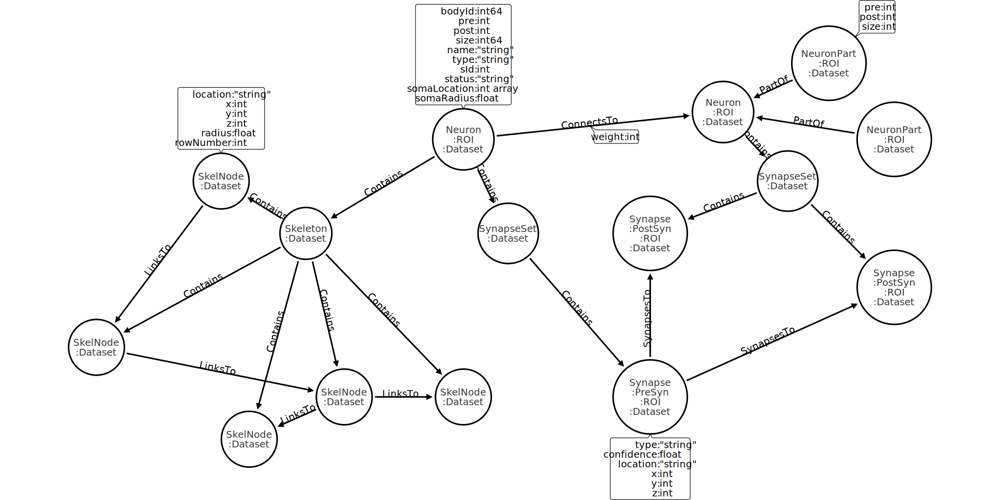

[](https://travis-ci.org/connectome-neuprint/neuPrint)

# neuPrint
A blueprint of the brain. A set of tools for loading and analyzing connectome data into a Neo4j database. Analyze connectome data stored in Neo4j using [neuPrintExplorer](https://github.com/connectome-neuprint/neuPrintExplorer). 

[Javadocs](https://connectome-neuprint.github.io/neuPrint/)

## Requirements
* Neo4j version 3.4.5
* [apoc version 3.4.0.2](https://neo4j-contrib.github.io/neo4j-apoc-procedures/)

## Example data

* mb6 : from ["A connectome of a learning and memory center in the adult Drosophila brain"](https://elifesciences.org/articles/26975) (Takemura, et al. 2017)

* fib25 : from ["Synaptic circuits and their variations within different columns in the visual system of Drosophila"](https://www.pnas.org/content/112/44/13711) (Takemura, et al. 2015)

## Load mb6 connectome data into Neo4j

1. After cloning the repository, set uri, user, and password in the example.properties file to match the those of the target database. You can also change the batch size for database transactions in this file (default is 100). Unzip mb6_neo4j_inputs.zip.  

2. Run the following on the command line:
```console
$ java -jar neuprinter.jar --dbProperties=example.properties --doAll --datasetLabel=mb6 --dataModelVersion=1.0 --neuronJson=mb6_neo4j_inputs/mb6_Neurons_with_nt.json --synapseJson=mb6_neo4j_inputs/mb6_Synapses.json
```

## Load mb6 skeleton data into Neo4j

1. Follow step 1 above. 

2. Run the following on the command line:
```console
$ java -jar neuprinter.jar --dbProperties=example.properties --prepDatabase --addSkeletons --datasetLabel=mb6 --dataModelVersion=1.0 --skeletonDirectory=mb6_neo4j_inputs/mb6_skeletons
```
## Load your own connectome data into Neo4j using neuprint

Follow these [input specifications](jsonspecs.md) to create your own neurons.json, synapses.json, and skeleton files. To create a database on your computer, use [Neo4j Desktop](https://neo4j.com/download/?ref=product).

```console
$ java -jar neuprinter.jar --help

Usage: java -cp neuprinter.jar org.janelia.flyem.neuprinter.NeuPrinterMain 
      [options] 
  Options:
    --addAutoNames
      Indicates that automatically generated names should be added for this 
      dataset. Auto-names are in the format ROIA-ROIB_8 where ROIA is the roi 
      in which a given neuron has the most inputs (postsynaptic densities) and 
      ROIB is the roi in which a neuron has the most outputs (presynaptic 
      densities). The final number renders this name unique per dataset. Names 
      are only generated for neurons that have greater than the number of 
      synapses indicated by neuronThreshold. If neurons do not already have a 
      name, the auto-name is added to the name property. (skip to omit)
      Default: false
    --addAutoNamesOnly
      Indicates that only the autoNames should be added for this dataset. 
      Requires the existing dataset to be completely loaded into neo4j. Names 
      are only generated for neurons that have greater than the number of 
      synapsesindicated by neuronThreshold (omit to skip)
      Default: false
    --addConnectsTo
      Indicates that ConnectsTo relations should be added (omit to skip)
      Default: false
    --addMetaNodeOnly
      Indicates that only the Meta Node should be added for this dataset. 
      Requires the existing dataset to be completely loaded into neo4j. (omit 
      to skip)
      Default: false
    --addSegmentRois
      Indicates that neuron ROI labels should be added (omit to skip)
      Default: false
    --addSkeletons
      Indicates that skeleton nodes should be added (omit to skip)
      Default: false
    --addSynapseSets
      Indicates that synapse set nodes should be added (omit to skip)
      Default: false
    --addSynapses
      Indicates that synapse nodes should be added (omit to skip)
      Default: false
    --addSynapsesTo
      Indicates that SynapsesTo relations should be added (omit to skip)
      Default: false
  * --dataModelVersion
      Data model version (required)
      Default: 0.0
  * --datasetLabel
      Dataset value for all nodes (required)
  * --dbProperties
      Properties file containing database information (required)
    --doAll
      Indicates that both neurons and synapses JSONs should be loaded and all 
      database features added
      Default: false
    --editMode
      Indicates that neuprinter is being used in edit mode to alter data in an 
      existing database (omit to skip).
      Default: false
    --help

    --loadNeurons
      Indicates that data from neurons JSON should be loaded to database (omit 
      to skip)
      Default: false
    --loadSynapses
      Indicates that data from synapses JSON should be loaded to database 
      (omit to skip)
      Default: false
    --neuronJson
      JSON file containing neuron data to import
    --neuronThreshold
      Integer indicating the number of synaptic densities (>=neuronThreshold/5
      pre OR >=neuronThreshold post) a neuron should have to be given the
      label of :Neuron (all have the :Segment label by default) and an
      auto-name (default is 10). To add auto-names, must have --addAutoName OR
      --addAutoNamesOnly enabled.
    --prepDatabase
      Indicates that database constraints and indexes should be setup (omit to 
      skip) 
      Default: false
    --skeletonDirectory
      Path to directory containing skeleton files for this dataset
    --synapseJson
      JSON file containing body synapse data to import
```

## Neo4j Property Graph Model



All nodes have a time stamp indicating last update in the format YYYY-MM-DDTHH:MM:SS. Segments with greater than a specified number of synaptic densities are labeled Neuron. Note: ConnectsTo weights are equal to the number
of SynapsesTo relationships for a particular connection. Assuming that the ratio of pre to post for each synaptic connection can be 1:1 or 1:many but never many:1, this is equal to number of postsynaptic densities for a connection.

### :Neuron/:Segment properties
* pre: number of presynaptic densities
* post: number of postsynaptic densities
* size: size of body in voxels
* name: name of neuron
* type: type of neuron
* bodyId: int64 identifier (unique per dataset)
* status: status of neuron
* somaLocation: 3D Cartesian location
* somaRadius: radius of soma
* roiInfo: string containing json map in format {"roiA":{"pre":1,"post":2},...}
* \<roi\>: boolean indicating that body is located in a particular roi (if present, always true)
* (optional) autoName: automatically generated name in format \<max input roi\>-\<max output roi\>_\<instance number\> (unique per dataset)

### :Synapse properties
* type: type of synapse
* confidence: confidence
* location: 3D Cartesian location (unique per dataset)
* \<roi\>: boolean indicating that synapse is located in a particular roi (if present, always true)

### :SkelNode properties
* location: 3D Cartesian location
* radius: radius
* rowNumber: row number within swc file
* type: type of node indicated in swc file

### :ConnectsTo properties
* weight: number of presynaptic densities per connection

### :Meta
* lastDatabaseEdit: date and time of last database edit (YYYY-MM-DDTHH:MM:SS).
* dataset: string indicating dataset name
* totalPreCount: number of presynaptic densities in dataset
* totalPostCount: number of postsynaptic densities in dataset
* roiInfo: string containing json map in format {"roiA":{"pre":1,"post":2},...}

### :DataModel
* dataModelVersion: property graph model version number for database

## Neuprint Neo4j Stored Procedures

Place neuprint-procedures.jar into the plugins folder of your neo4j database, and restart the database. Under development. All features are experimental. 
### Proofreader procedures (READ/WRITE)
1. applies time stamp to nodes when they are created, when their properties change, when relationships are changed, and when relationship properties are changed. 
2. proofreader.mergeNeuronsFromJson(mergeJson, datasetLabel) : merge neurons from json file containing single mergeaction json
3. proofreader.cleaveNeuronsFromJson(cleaveJson, datasetLabel) : cleave neuron from json file containing a single cleaveaction json
3. proofreader.addSkeleton(fileUrl,datasetLabel): Load skeleton file from url into database and connect to appropriate neuron. Returns the new skeleton node. e.g.: ``` CALL proofreader.addSkeleton("http://fileurl/87475_swc","mb6") YIELD node RETURN node ```
### Analysis procedures (READ)
1. analysis.getLineGraph(bodyId,datasetLabel,vertexSynapseThreshold=50): used to produce an edge-to-vertex dual graph, or line graph, for a neuron. Returned value is a map with the vertex json under key "Vertices" and edge json under "Edges". 
2. analysis.getConnectionCentroidsAndSkeleton(bodyId,datasetLabel,vertexSynapseThreshold=50) Provides the synapse points and centroid for each type of synaptic connection (e.g. neuron A to neuron B) present in the neuron with the provided bodyId as well as the skeleton for that body. Returned value is a map with the centroid json " +
under key "Centroids" and the skeleton json under key "Skeleton". 
3. analysis.calculateSkeletonDistance(datasetLabel, SkelNodeA,SkelNodeB): Calculates the distance between two :SkelNodes for a body. See #4.
4. analysis.getNearestSkelNodeOnBodyToPoint(bodyId,datasetLabel,x,y,z): Returns the :SkelNode on the given body's skeleton that is closest to the provided point. To be used with #3.
5. analysis.getInputAndOutputCountsForRois(bodyId,datasetLabel): Produces json array with counts of inputs and outputs per roi for a given neuron.
6. analysis.getInputAndOutputFeatureVectorsForNeuronsInRoi(roi,datasetLabel,synapseThreshold): Produces json array with input and output feature vectors for each neuron in the provide ROI. Vectors contain the synapse count per ROI.
### neuprintUserFunctions (READ, output a single value)
1. neuprint.locationAs3dCartPoint(x,y,z) : returns a 3D Cartesian org.neo4j.graphdb.spatial.Point type with the provided coordinates. 
      

