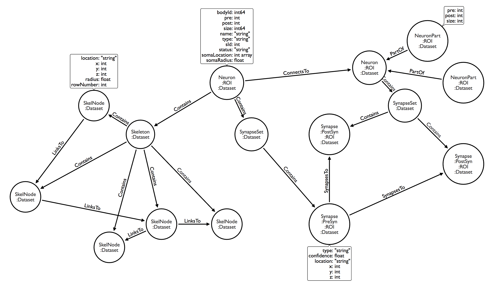

# neuPrint
A tool for loading connectome data into a Neo4j database. Analyze connectome data stored in Neo4j using [ConnectomeAnalyzer](https://github.com/janelia-flyem/ConnectomeAnalyzer). 

## Requirements
* Neo4j version 3.4.0
* [apoc version 3.4.0.1](https://neo4j-contrib.github.io/neo4j-apoc-procedures/)

## Example data

* mb6 : from ["A connectome of a learning and memory center in the adult Drosophila brain"](https://elifesciences.org/articles/26975) (Takemura, et al. 2017)

* fib25 : from ["Synaptic circuits and their variations within different columns in the visual system of Drosophila"](https://www.pnas.org/content/112/44/13711) (Takemura, et al. 2015)

## Load mb6 connectome data into Neo4j

1. After cloning the repository, set uri, user, and password in the example.properties file to match the those of the target database. You can also change the batch size for database transactions in this file (default is 100). Unzip mb6_neo4j_inputs.zip.  

2. Run the following on the command line:
```console
$ java -jar neuprinter.jar --dbProperties=example.properties --doAll --datasetLabel=mb6 --neuronJson=mb6_neo4j_inputs/mb6_Neurons_with_nt.json --synapseJson=mb6_neo4j_inputs/mb6_Synapses.json
```

## Load mb6 skeleton data into Neo4j

1. Follow step 1 above. 

2. Run the following on the command line:
```console
$ java -jar neuprinter.jar --dbProperties=example.properties --prepDatabase --addSkeletons --datasetLabel=mb6 --skeletonDirectory=mb6_neo4j_inputs/mb6_skeletons
```
## Load your own connectome data into Neo4j using neuPrint

Follow these [input specifications](jsonspecs.md) to create your own neurons.json, synapses.json, and skeleton files. To create a database on your computer, use [Neo4j Desktop](https://neo4j.com/download/?ref=product).

```console
$ java -jar neuprinter.jar --help

Usage: java -cp neuprinter.jar ConnConvert
      [options]
  Options:
    --addConnectsTo
      Indicates that ConnectsTo relations should be added (omit to skip)
      Default: false
    --addNeuronParts
      Indicates that neuron parts nodes should be added (omit to skip)
      Default: false
    --addNeuronRois
      Indicates that neuron ROI labels should be added (omit to skip)
      Default: false
    --addSkeletons
      Indicates that skeleton nodes should be added (omit to skip)
      Default: false
    --addSynapseSets
      Indicates that synapse set nodes should be added (omit to skip)
      Default: false
    --addSynapses
      Indicates that synapse nodes should be added (omit to skip)
      Default: false
    --addSynapsesTo
      Indicates that SynapsesTo relations should be added (omit to skip)
      Default: false
    --bigThreshold
      Total number of synapses for a body must be greater than this value for
      the body to be considered "Big" and be given an sId (must be an integer;
      default is 10)
    --createLog
      Indicates that log file should be created (omit to skip)
      Default: false
  * --datasetLabel
      Dataset value for all nodes (required)
  * --dbProperties
      Properties file containing database information (required)
    --doAll
      Indicates that both Neurons and Synapses jsons should be loaded and all
      database features added
      Default: false
    --editMode
      Indicates that neuprinter is being used in edit mode to alter data in an
      existing database (omit to skip).
      Default: false
    --help

    --loadNeurons
      Indicates that data from neurons json should be loaded to database (omit
      to skip)
      Default: false
    --loadSynapses
      Indicates that data from synapses json should be loaded to database
      (omit to skip)
      Default: false
    --neuronJson
      JSON file containing neuron data to import
    --prepDatabase
      Indicates that database constraints and indexes should be setup (omit to
      skip)
      Default: false
    --skeletonDirectory
      Path to directory containing skeleton files for this dataset
    --synapseJson
      JSON file containing body synapse data to import
```

## Neo4j Property Graph Model



### :Neuron properties
* pre: number of presynaptic terminals
* post: number of postsynaptic terminals
* size: size of body in voxels
* name: name of neuron
* type: type of neuron
* bodyId: int64 identifier (unique per data set)
* sId: id indicating rank of neuron by number of synapses in descending order (starts with 0; only given to bodies with > 10 synapses)
* status: status of neuron
* somaLocation: location of soma ([x,y,z])
* somaRadius: radius of soma

### :Synapse properties
* type: type of synapse
* confidence: confidence
* location: string indicating location in format "x:y:z" (unique per data set)
* x: x coordinate 
* y: y coordinate
* z: z coordinate

### :NeuronPart properties
* pre: number of presynaptic terminals in this roi
* post: number of postsynaptic terminals in this roi
* size: total number of synapses in this roi

### :SkelNode properties
* location: location string in format "x:y:z"
* x: x coordinate 
* y: y coordinate
* z: z coordinate
* radius: radius
* rowNumber: row number within swc file

## neuPrint Neo4j Stored Procedures

Place neuprint-procedures.jar into the plugins folder of your neo4j database, and restart the datbase. Under development. Current features:
1. applies time stamp to nodes when they are created, when their properties change, when relationships are changed, and when relationship properties are changed. 
2. proofreader.mergeNeurons(node1BodyId,node2BodyId,datasetLabel): For the neuron nodes with the given bodyIds within the dataset, merge neurons into a new neuron. Returns the new neuron node. e.g.: ``` CALL proofreader.mergeNeurons(87475,12678,"mb6") YIELD node RETURN node ```
      * The new neuron inherits all ConnectsTo, Contains, and PartOf relationships and all labels from the original neurons.
      * SynapseSets will be combined into one. Skeletons will be deleted. NeuronParts will be combined. 
      * The new neuron inherits bodyId from the first listed neuron. All other properties are inherited from the first listed neuron or, if a property is null for that neuron, the second listed neuron. Property names on the original neurons start with "merged", e.g. "mergedBodyId".
      * Original neurons lose all labels and relationships, and "MergedTo" relationships are created between the original neurons and the new neuron. 
      

