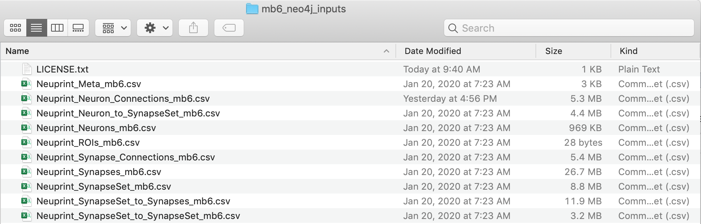
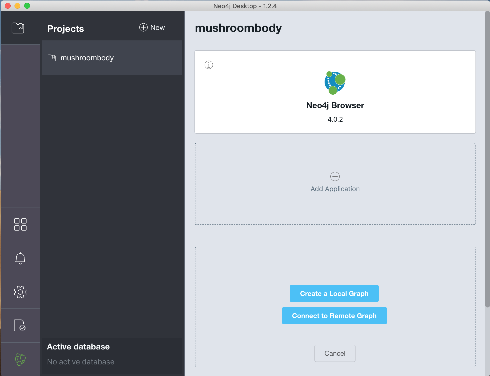
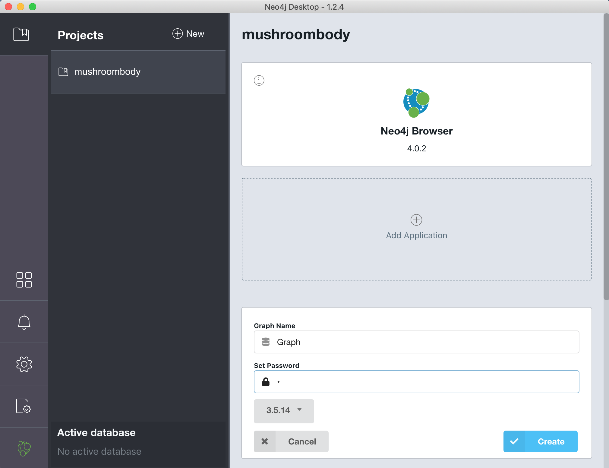
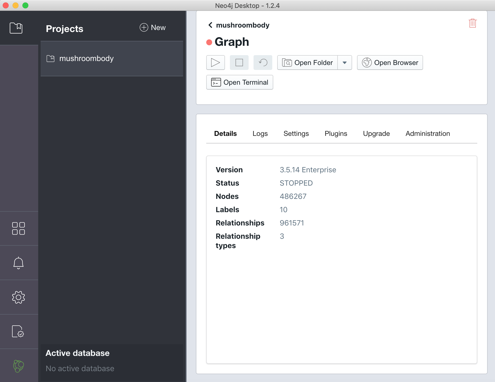
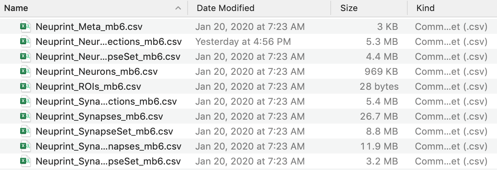
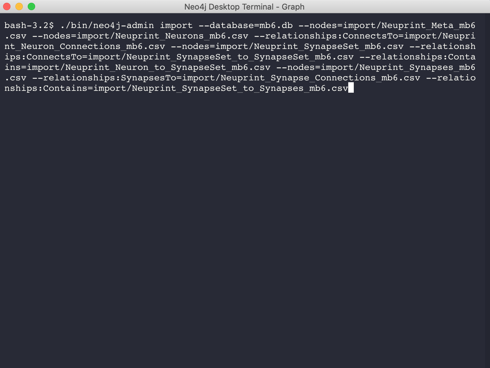
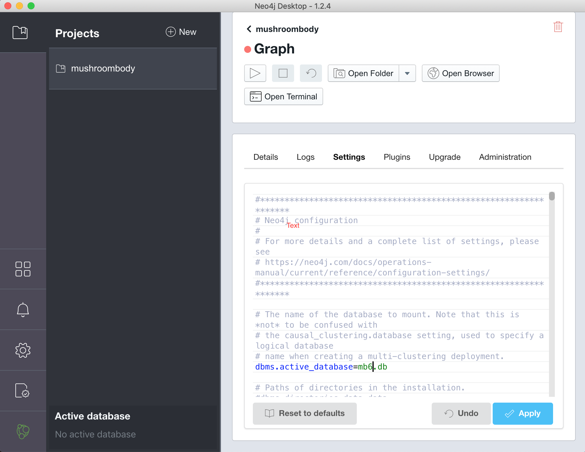
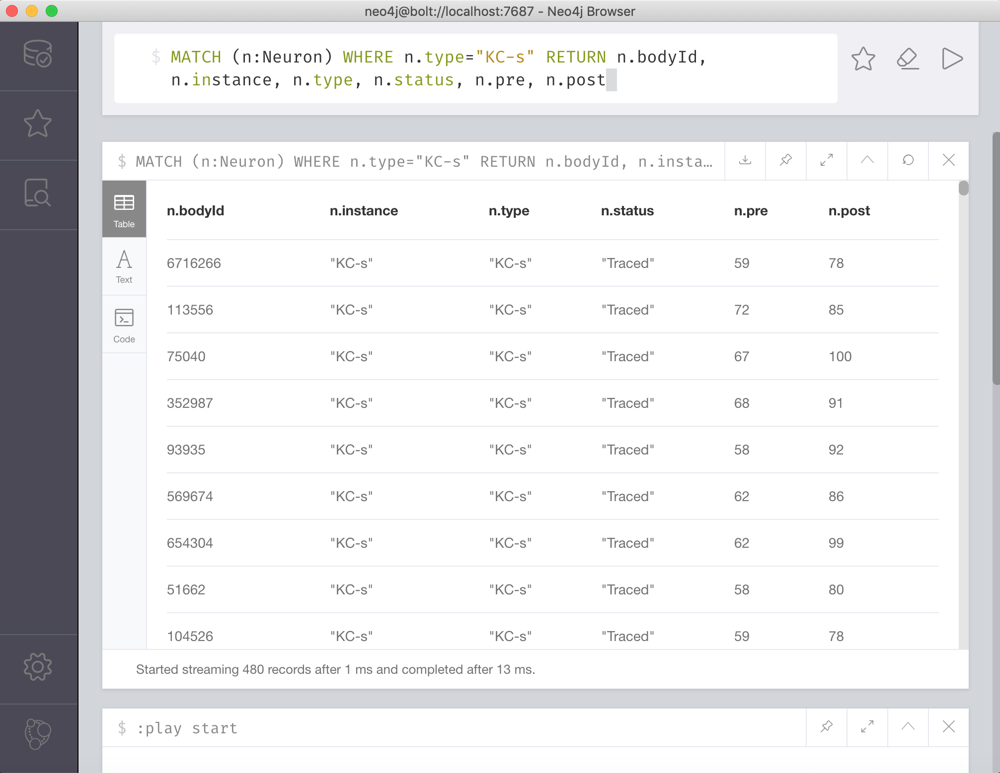

# Creating a Mushroombody(mb6) neuPrint into neo4J Desktop
This is a step-by-step guide on how to create the mushroombody(mb6) neuPrint graph database using neo4J Desktop application.

1. Download [neo4j desktop](https://neo4j.com/download-center/#desktop).
2. Download and unzip mb6_neo4j_inputs.zip from this github repository. There should be 10 csv files.

3. Start Neo4J Desktop and create a new project, in this example we'll call it mushroombody.
4. Create a new graph by clicking on "Add Graph", then select "Create a Local Graph".

5. Enter a password when prompted and click on "Create".

6. Once the Graph is created. Click on "Manage".

7. On the Graph Management Interface. Click the pull down on "Open Folder" and select the first option "Import".
8. This will open the import directory. Copy all 10 csv files from your mb6_neo4j_inputs folder to the import directory.

9. Go back to the Graph Management Interface and selct "Open Terminal"
10. Copy the command line below into the terminal and hit return. Note that the database is named `mb6.db`. This command will import each csv file into neo4j. It will take a few seconds to load up. Once the script has finished and returns to the terminal prompt, you can close the terminal window.

```
./bin/neo4j-admin import --database=mb6.db --nodes=import/Neuprint_Meta_mb6.csv --nodes=import/Neuprint_Neurons_mb6.csv --relationship=ConnectsTo=import/Neuprint_Neuron_Connections_mb6.csv --nodes=import/Neuprint_SynapseSet_mb6.csv --relationships=ConnectsTo=import/Neuprint_SynapseSet_to_SynapseSet_mb6.csv --relationships=Contains=import/Neuprint_Neuron_to_SynapseSet_mb6.csv --nodes=import/Neuprint_Synapses_mb6.csv --relationships=SynapsesTo=import/Neuprint_Synapse_Connections_mb6.csv --relationships=Contains=import/Neuprint_SynapseSet_to_Synapses_mb6.csv
```

11. Return to the Graph Management Interface and select Settings. Delete the `#` on the line with the text `dbms.active_database=graph.db` and replace it with the name of the database we used on import `dbms.active_database=mb6.db`. Click on "Apply" once you are finished

12. Click on the "Play" button on the Graph Management Interface to start the neo4j server for your project. At this point the red dot will turn yellow and eventually green once the server is up and running. Click on "Open Browser" to access the Neo4J Browser. Paste the example query below to test searching for some mushroom body neurons.

```MATCH (n:Neuron) WHERE n.type="KC-s" RETURN n.bodyId, n.instance, n.type, n.status, n.pre, n.post```

