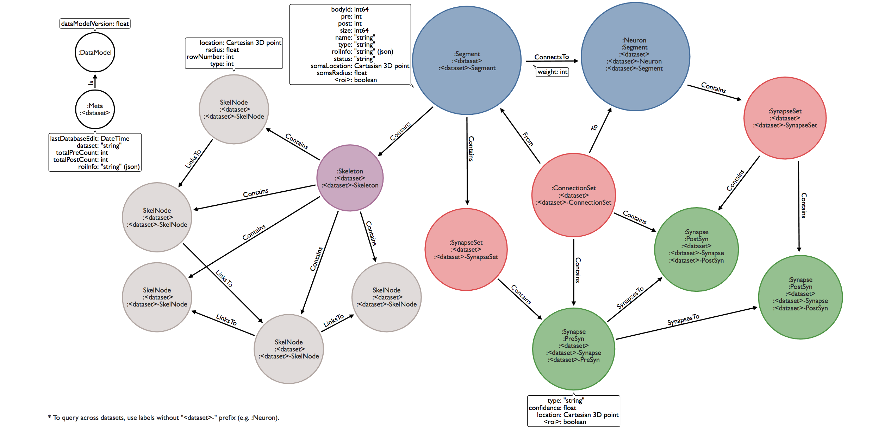

## Neo4j Property Graph Model



Notes:
* All nodes have a time stamp (property name: *timeStamp*) indicating last update in the format YYYY-MM-DDTHH:MM:SS. 
* **Segment** nodes with greater than a specified number of synaptic densities are also labeled **Neuron**. 
* **ConnectsTo** weights are equal to the number of **SynapsesTo** relationships for a particular connection. Assuming that the ratio of pre to post for each synaptic connection can be 1:1 or 1:many (but never many:1) this is equal to number of postsynaptic densities for a connection.
* Each neuron/segment has one **SynapseSet** node, which **Contain**s all the **Synapse** nodes for that body. Each **ConnectsTo** relationship has a corresponding **ConnectionSet** node, which **Contain**s all the **Synapse** nodes involved in that particular connection. These can be accessed via **From** and **To** relationships with the presynaptic and postsynaptic neuron, respectively
* A neuron/segment is considered to be in an ROI if it has >= 1 presynaptic or postsynaptic density in that ROI.

Features specific to the hemibrain dataset:
* All **Segment** nodes with >=2 t-bars, >=10 psds, a name, a status, or a soma are labeled **Neuron**.
* An automatically generated name (autoName) has been given to some **Neuron** nodes (format: \<max input roi\>-\<max output roi\>_\<instance number\>). If the neuron did not have a name during the initial load, this autoName was added to the name property. These automatically generated names can be distinguished from names given by a human by the presence of a terminating asterisk (e.g. the cypher predicate ```WHERE n.name NOT ENDS WITH "*"``` will be true for human-generated names).

### :Neuron/:Segment properties
* pre: number of presynaptic densities
* post: number of postsynaptic densities
* size: size of body in voxels
* name: name of neuron
* type: type of neuron
* bodyId: int64 identifier (unique per dataset)
* status: status of neuron
* somaLocation: 3D Cartesian location
* somaRadius: radius of soma
* roiInfo: string containing json map in format {"roiA":{"pre":1,"post":2},...}
* \<roi\>: boolean indicating that body is located in a particular roi (if present, always true)
* (optional) autoName: automatically generated name in format \<max input roi\>-\<max output roi\>_\<instance number\> (unique per dataset)

### :Synapse properties
* type: type of synapse
* confidence: confidence
* location: 3D Cartesian location (unique per dataset)
* \<roi\>: boolean indicating that synapse is located in a particular roi (if present, always true)

### :SkelNode properties
* location: 3D Cartesian location
* radius: radius
* rowNumber: row number within swc file
* type: type of node indicated in swc file

### :ConnectsTo properties
* weight: number of postsynaptic densities per connection
* weightHP: number of high-precision postsynaptic densities per connection

### :ConnectionSet properties
* roiInfo: string containing json map in format {"roiA":{"pre":1,"post":2,"preHP":1,"postHP":1},...} where preHP and postHP indicate counts of high-precision synaptic densities

### :Meta
* lastDatabaseEdit: date and time of last database edit (YYYY-MM-DDTHH:MM:SS).
* dataset: string indicating dataset name
* totalPreCount: number of presynaptic densities in dataset
* totalPostCount: number of postsynaptic densities in dataset
* roiInfo: string containing json map in format {"roiA":{"pre":1,"post":2},...}
* preHPThreshold: float (high-precision pre threshold)
* postHPThreshold: float (high-precision post threshold)

### :DataModel
* dataModelVersion: property graph model version number for database
